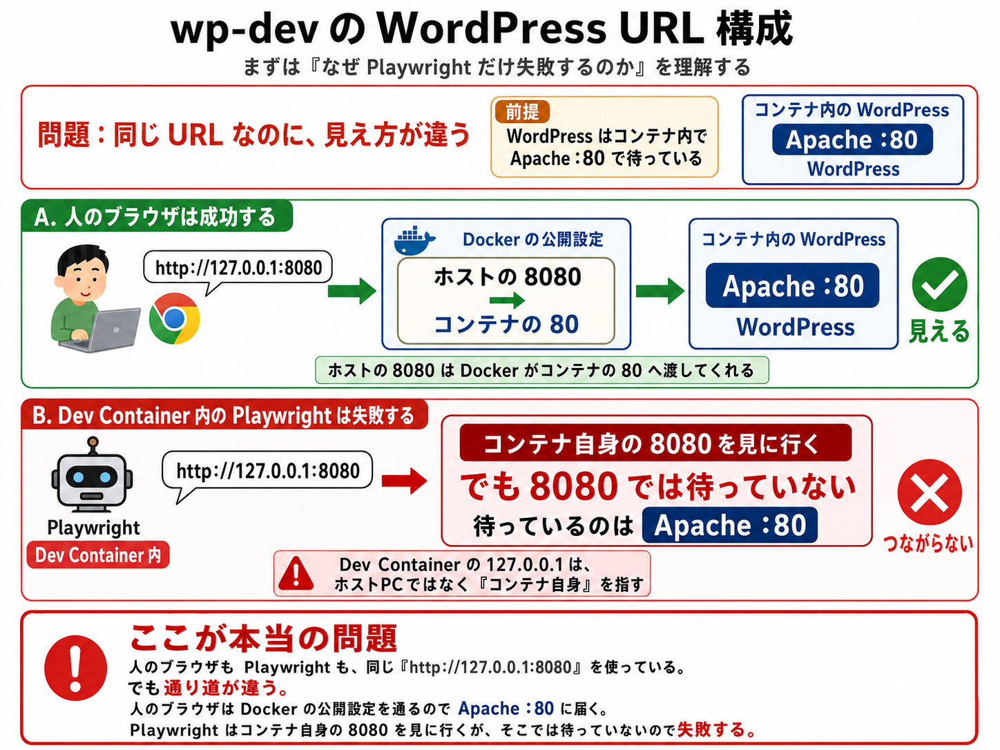
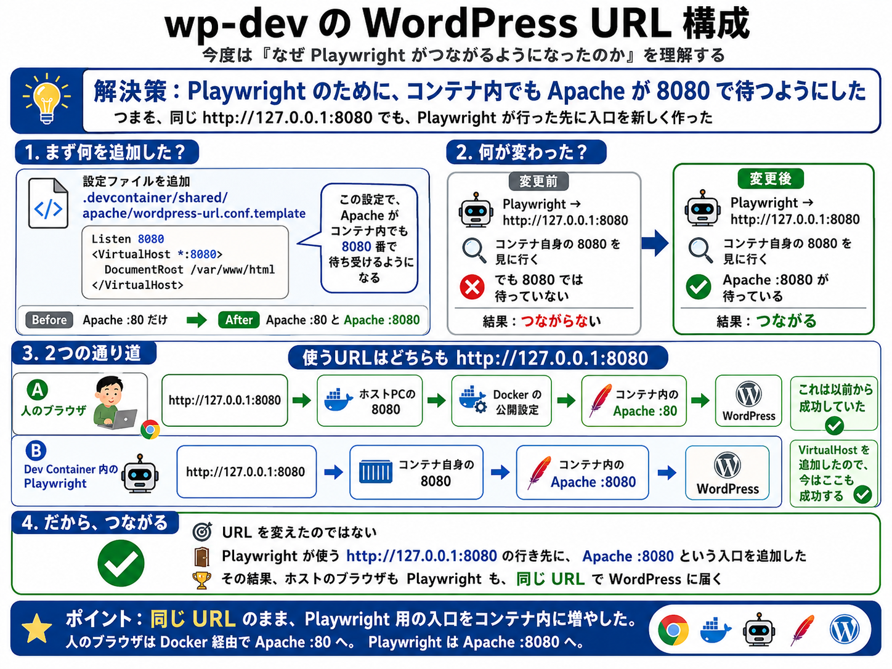
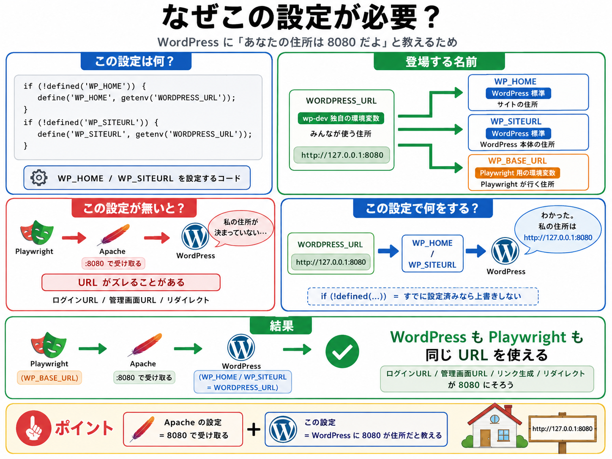

# WordPress URL 構成

`wp-dev` では、ホストのブラウザと Dev Container 内の Playwright から、同じ WordPress URL を使用します。

`default` は `http://127.0.0.1:8080`、`wp683` は `http://127.0.0.1:8081` を使用します。

## 問題

同じ URL を使っていても、ホストと Dev Container では `127.0.0.1` が指す場所と通信経路が異なります。

## 解決策

Playwright がアクセスするコンテナ内部のポートでも Apache が待ち受けるようにします。

Apache の追加待受は `.devcontainer/shared/apache/wordpress-url.conf.template` で定義します。

## WordPress の住所設定

Apache に入口を追加するだけでなく、WordPress 自身にも使用する URL を明示します。

`WP_HOME` または `WP_SITEURL` がすでに定義されている場合は上書きしません。

## 設定の基準

URL を変更する場合は、環境ファイルの `WORDPRESS_HOST` または `WORDPRESS_PORT` を変更します。

`WORDPRESS_URL` と `WP_BASE_URL` は Docker Compose がそこから導出するため、個別には設定しません。

Playwright の `webServer` は使用せず、Dev Container ですでに起動している WordPress に接続します。
